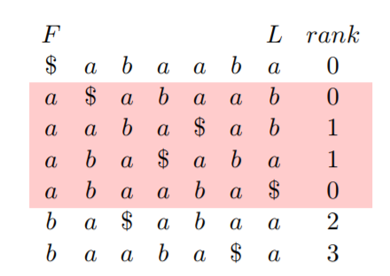
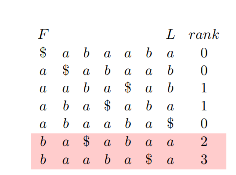

# BWT算法实验报告
## 170810 曹聪聪 
## 一 算法概述
Burrows-Wheeler transform(BWT，也被称作block-sorting compression)可以将字符串重新排序，使得相近的字符靠近。经过BWT变换的字符串可以方便用于其他技术如：Move-to-front变化或游程编码等进行进一步压缩。同时，BWT变化是一种可逆的变化，在进行逆操作的时候仅仅需要变化后的数据而不需要额外的空间。

## 二 算法原理
### 1 编码算法
BWT编码算法原理很简单，对原始数据进行n次循环右移，n为字符串的长度。将移位后的n个字符串按照字典顺序进行排序，排序后的最后一列就是BWT算法编码后的结果。具体的算法流程如下：
```
function BWT (string s)
   create a table, rows are all possible rotations of s
   sort rows alphabetically
   return (last column of the table)
```
以banana为例，BWT的编码过程见下表：
<div align=center>

NO.| 右移结果 | 排序后结果 | F | L |
----|------|----|-------|-----
1| dogwood# |  #dogwood| # | d |
2 | #dogwood  | d#dogwoo| d|o|
3 | d#dogwoo  |dogwood#|d|#|
4 | od#dogwo  |gwood#do|g|o
5 | ood#dogw  | od#dogwo|o|o
6 | wood#dog  | ogwood#d|o|d
7 | gwood#do  |ood#dogw|o|w
8| ogwood#d| wood#dog|w|g

</div>
从上表可以看出，banana#经过BWT变化后变成annb#aa，可以产出相同的字符趋向于相邻。

### 2 解码算法
BWT的解码算法就是将BWT编码后产生的字符串恢复成原始数据。解码的思路为将编码结果排序得到原始排序后的第一列数据，然后再该列数据前对应加上BWT结果，对处理后字符串进行排序，重读上述操作直至生成长度为n的字符串。
```
function inverseBWT(string s)
    B = [s1, s2, s3, ... sn ]
    for i = 1 .. n:
        sort B
        prepend si to B[i]
    return row of B of begin index
```
一个BWT解码的实例见下图：


从上图可以看出BWT的解码算法可以无损地恢复出原始字符串。
### 3 通过LF Mapping进行解码
在BWT的实际解码过程中，保存所有的字符串是不现实的。BWT算法有一种重要的特性叫做LF Mapping，相同字符在最后一行出现的顺序和第一行出现的顺序是相同的，通过该种特性可以方便地进行解码。

由于相同字符串在第一行和最后一行出现的顺序是相同的，同时在原始序列中，最后一行的字符是其所在行首个字符的前一位。根据这两个特性，我们仅仅需要首尾两行就可以将原始序列恢复出来。其伪代码如下所示：

```
function inverseBWTbyLF(string L)
    string F = sort(L)
    index = begin index
    Leng = string.length
    while(leng > 0)
        result.append(L[index])
        index = index of F[i] in L with same order
    return result
```
首先对BWT编码后的字符串进行排序得到第一行的字符，然后首先找出L中起始位置，然后找出F中相同顺序的相同字符的L位置中对应的字符，该字符就是前一个字符的下一个字符。按照上述依次进行，直至找到所有的字符。

为了能够快速的找到F中与L对应位置的相同字符，可以额外保存一组字符表示L中的顺序。
<div align=center>

| F | L | RANK
----|------|----|
| # | d |0
| d|o|0
|d|#|0
|g|o|1
|o|o|2
|o|d|1
|o|w|0
|w|g|0

</div>

上表中的rank表示L中的该字符在当前字符之前出现了多少次。

### 4 background search
background search是一种在BWT编码结果中进行字符查找的方法，该方法从待查找字符串的最后一个字符依次开始匹配。

以在abaaba中查找aba为例，首先需要眨着aba中的最后一个字符a。在F列中查找所有以a为开头的字符。
<div align=center>



</div>
在F列中以a为开头的字符串总共有四个，其前一个字符对应的字符为b的共有两个，转到以对应的b开头的F中的行，在本例中对应的是b0和b1。

<div align=center>



</div>

此时找到的两个b的前一个字符都是a,所以本次查找一共找到了两个aba。

在后向匹配中，我们使用LF Mapping不断寻找能匹配上待匹配字符P的后缀字符的的行，直至找到最后的需要的字符或者找不到。


## 三 代码实现

## 四 结果验证